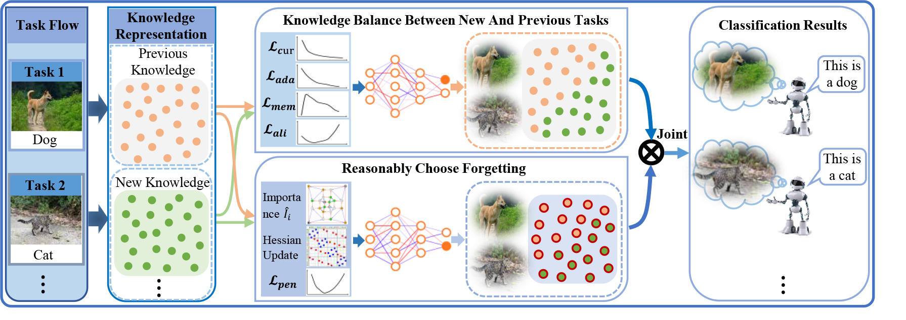

# SPIRF-CTA
This is the GitHub repo for paper *"SPIRF-CTA: Selection of Parameter Importance Levels for Reasonable Forgetting in Continuous Task Adaptation"*

**SPIRF-CTA: Selection of Parameter Importance Levels for Reasonable Forgetting in Continuous Task Adaptation**

**Qinglang Li**, **Jing Yang***,  **Xiaoli Ruan**,  **Shaobo Li**,  **Jianjun Hu**, **Bingqi Hu**

Our code is built upon the following repo:
https://github.com/facebookresearch/GradientEpisodicMemory/tree/master/model
https://github.com/BaiTheBest/SAMC

**This is the overall methodology diagram of the paper:**

Fig. 1.  Using the joint training of "balancing new and previous task knowledge" and "reasonable choice of 
forgetting" to realize reasonable forgetting and thus alleviate the problem of catastrophic forgetting,
Knowledge balancing is achieved by designing a multi-task loss function and a model-aligned loss function;
updating parameters are adjusted using the gradient information of the Hessian matrix and the design of 
important parameter calculations; and reasonable forgetting is achieved by combining with the corresponding
design of the loss function.

  

## Prerequisites
The following packages are required to run the scripts:
- Python 
- pytorch 
- torchvision
- numpy
- opencv-python
- pillow
- pandas
- scipy
- scikit-learn
- ttach
- utils
- quadprog

## Run the following command:

python main.py --n_layers 2 --n_hiddens 100 --data_path data/ --save_path results/ --batch_size 10 --log_every 100 --samples_per_task 2500 --data_file cifar100.pt --cuda yes  --model CTA --n_epochs 1 --lr 0.004 --n_memories 10 --memory_strength 0.5 --theta 0.6

**The remaining code can be obtained in https://github.com/facebookresearch/GradientEpisodicMemory/tree/master/model and https://github.com/BaiTheBest/SAMC**

